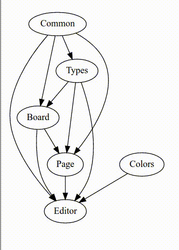

## Compilation Progress Graph

This is a *partial* solution to [Evan Czaplicki's idea presented
here](https://github.com/elm-lang/projects#visualize-compilation).

#### Related Work:

There are also two other ongoing efforts in elm to solve this problem,
by [John
Bugner](http://github.com/JohnBugner/elm-compilation-visualization)
and by [Manuel
Baumann](https://manuscripthub.github.io/elm-diagram/index.html).
There are other solutions such as [elm-compile-html by
Vondehaar](http://elm-compile-html.herokuapp.com/) and also
[html-to-elm by Bylstra](https://github.com/mbylstra/html-to-elm) for
converting arbitrary Html/Svg into elm code.

#### My Approach:

I have taken a slightly different approach of using a python script to
read the graph structure from the elm codebase, and then trying to use
the [graphviz/`{dot,tred}` programs](http://www.graphviz.org/)
directly as a *blackbox* and post-processing its SVG output into elm
code.

Here is output from an earlier version, running as a gif (the current
version does not display edges that are redundant by transitivity):

The script generates an elm program which is a proof-of-concept for
displaying compilation progress as a colored directed acyclic graph.
The nodes in the DAG are files, the arrows are dependencies, and the
node colors could change dynamically to indicate the state of
compilation, which is one of {Uncompiled (shown as White), Ready
(Gray), Compiling (Yellow), Failed (Red), Succeeded (Green)}.

It currently does not indicate actual compilation progress.  However
it demonstrates the ability to construct the graph page based on an
arbitrary codebase, and to change the node colors dynamically in
response to Msg's.

Here is a [much larger
example](https://aklaing.github.io/elm-visualize-compilation/) running
the latest version on [Soren Debois' elm-mdl
codebase](https://github.com/debois/elm-mdl), as of version 7.0.  It
may be helpful to use (Ctrl-'-') to reduce the graph size to fit in
your browser window.

Graph drawing is a subject of CS research as may be seen from [this
paper](https://www.ocf.berkeley.edu/~eek/index.html/tiny_examples/thinktank/src/gv1.7c/doc/dotguide.pdf),
its references and any other papers that cite this.  I believe that
treating `dot` as a blackbox means the license does not matter.  On
the other hand, by not implementing my own layout library, I am not
being helpful to someone who may want to do graph layout for a
different elm application, or may not want to install python -- I
realize that.  Anyway, it is what it is, but I hope this
implementation will contribute something to the effort.

To make this a useful tool, what remains to be done is the generation
of the progress events from the compiler.  And communicating them from
the compiler to a running elm program somehow.

#### Notes on Graph Layout with dot:

- For this application, it is not valuable in my opinion to display
  transitive edges.  Eg.  If **C** depends on **B** and **B** depends
  on **A**, but **C** also directly imports **A**, the program will
  not indicate that import from **C** to **A** in the graph.  This
  helps reduce clutter from the output graph, for complicated
  projects.  For this reason, the dependency output is preprocessed
  with 'tred' before calling 'dot'.

- In order to fit larger projects more easily in smaller spaces,
  compilation progress is from left to right, because dependencies
  tend to be shallow but wide.  Meaning, it is rare to find a module
  dependency chain that is very deep (**A** depends on **B** depends
  on **C** depends on ...), compared to how often one finds many cases
  of dependencies **X** all of which depend on the same **A**.  For
  example in the `elm-mdl` codebase as of September 2016, there is one
  module imported by 19 others, but the longest dependency chain has 7
  modules.  I believe this situation is more likely to be the case in
  many code bases.  Since English text is written from left to right,
  more space is available for the latter case (the 19 nodes importing
  one) when the many children of **A** are displayed vertically.  This
  is achieved by using the the 'rankdir=LR;' options.

- There are different options for the `splines` argument to dot, but
  personally I have found the `true` default to be most visually
  pleasing.  It is possible to allow the end-user to choose what type
  of arrows they want and pass that through to `dot`.

#### Limitations:

- It assumes you use git for your project version control.

- You need to have dot and python installed on your path somewhere.

- It creates temporary files called .ReducedDigraph.elm, .digraph.dot,
  .reduced-digraph.dot, .reduced-digraph.svg.  This can be refined to
  use real temp files in `/tmp`.

#### Files:

`build-graph.py` -- The python script that reads the dependency graph
from the elm files and creates the elm view function by calling dot
for layout information.

`CompilerPreamble.elm` -- This creates a static-looking uncolored build
graph in an index.html file.  If instead you build a js script and
provide an index.html which implements the port on the javascript
side, the elm program will respond to the events received through the
port by changing node colors appropriately.  The corresponding
makefile target is 'compilerUi'.

`SimulatorPreamble.elm` -- This is a simulation of a compilation.
Random events are generated subject to the normal constraints that
each node must have all of its dependencies built before it can become
ready to be built.  Only 4 nodes can compile at the same time.  The
rest are 'Ready' until they can compile.  The corresponding makefile
target is 'sim'.

`makefile` -- You can edit a directory path in this makefile and call
either the target 'sim' or 'compilerUi' to get one of the two versions
of the program, for any elm codebase you want (which must be locally
installed on your machine).

`Demo.elm`, `Demo.html`, `demo.js` -- older files that were used to
create the gif, based on an earlier version of the script.

#### Possible Improvements:

- Make the nodes clickable, with each click sending a standard event
  parametrized by the name of the node, to the elm update function.
  Maybe instead of indicating just which node is being updated to what
  state, we also indicate what its onClick link should become,
  dynamically.

- It may be a concern to design this for more universal accessibility,
  in which case Red and Green should not both be used (by some
  individuals who cannot distinguish them).  Probably in an ideal
  scenario, a user would be able to choose their own color scheme, but
  the current situation hard-codes the use of Red and Green, since
  this is just a proof-of-concept.

